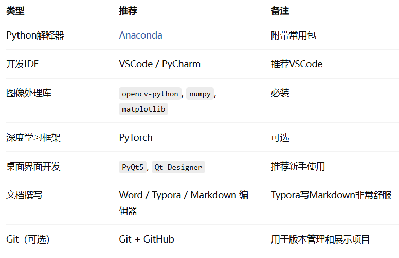

# ? 一、整体开发流程
1、做桌面端（推荐初学者用 PyQt），后期有时间再加Web端(可以比较轻松地改为Streamlit版本)

2、环境配置与工具准备（本地开发）
安装 Python（建议使用 Anaconda 管理环境）
安装核心库：opencv-python, numpy, matplotlib

3、桌面开发：安装 PyQt5 和 Qt Designer

4、深度学习（可选）：安装 PyTorch 和 torchvision

5、可视化工具：Jupyter Notebook（用于调试算法）或 VSCode（完整开发）

6、各模块功能实现（见下节细分）

- 建议按照模块顺序进行：图像读取 → 空间域增强 → 频域处理 → 分割 → 拼接 → 复原
- 每个模块都输出代码 + 效果图 + 分析
- 系统界面开发与集成
- 把各模块封装为函数，集成到界面中
  
桌面端：PyQt设计界面 → 用按钮连接函数
Web端：Flask路由函数 → 页面展示上传图像与结果

7、文档与报告编写
每完成一个模块就立刻写实验报告段落：包括任务描述、算法原理、代码实现、实验结果与分析
整体项目完成后，整理成《系统设计说明书》

8、验收准备
准备演示项目文件、截图结果、展示PPT、整理代码文件夹
___
# ? 二、各步骤预计耗时 & 所需知识/工具
| 步骤 | 内容      | 预计耗时 | 需掌握知识                     | 推荐工具               |
| -- | ------- | ---- | ------------------------- | ------------------ |
| 1  | 环境配置    | 1天   | Python基础，包管理              | Anaconda, pip      |
| 2  | 图像基础操作  | 1-2天 | OpenCV图像读取、显示、保存、ROI      | OpenCV             |
| 3  | 空间域图像增强 | 2-3天 | 灰度变换、滤波、锐化、均衡化            | NumPy, OpenCV      |
| 4  | 频域处理    | 2-3天 | 傅里叶变换、频域滤波器设计             | NumPy FFT          |
| 5  | 图像分割    | 2-3天 | Otsu, Canny, 深度模型（U-Net等） | OpenCV, PyTorch    |
| 6  | 图像拼接与融合 | 3-5天 | SIFT、RANSAC、图像配准          | OpenCV-contrib     |
| 7  | 图像复原    | 3-5天 | 图像去雾、去模糊、老照片修复            | OpenCV, 深度模型       |
| 8  | 系统界面开发  | 3-5天 | PyQt UI设计、信号槽机制           | PyQt5, Qt Designer |
| 9  | 文档撰写    | 并行进行 | 模块设计文档、实验报告撰写             | Word, Markdown     |
# 推荐功能选择以及开发流程建议
| 类型   | 推荐功能           | 模块名                  | 开发难度 | 推荐理由            |
| ---- | -------------- | -------------------- | ---- | --------------- |
| 图像变换 | 缩放、旋转、裁剪       | `resize.py`          | ?    | 实现简单，演示直观       |
| 增强   | 线性增强、直方图均衡化    | `enhancement.py`     | ??   | OpenCV直接支持      |
| 滤镜   | 高斯模糊、中值滤波、锐化   | `filters.py`         | ??   | 滤波器种类多，可扩展      |
| 颜色变换 | RGB ? 灰度/HSV   | `color_transform.py` | ?    | 非常简单但很实用        |
| 分割   | Otsu、边缘检测      | `segmentation.py`    | ???  | 分割视觉效果好，便于展示    |
| 识别   | 图像中数字识别（MNIST） | `recognition.py`     | ???? | 需要深度学习支持，可选加分功能 |

| 阶段 | 任务                          | 所用工具           | 建议耗时 |
| -- | --------------------------- | -------------- | ---- |
| 1  | 搭建环境（Anaconda+PyQt5+OpenCV） | 本地             | 0.5天 |
| 2  | 实现图像加载/显示/保存 + 缩放功能         | 本地+Colab       | 1天   |
| 3  | 开发滤镜、颜色变换模块                 | Colab开发 → 本地整合 | 2天   |
| 4  | 实现增强或分割等模块                  | 同上             | 2-3天 |
| 5  | 设计 PyQt 界面 + 模块集成           | 本地             | 2-3天 |
| 6  | 撰写文档与测试                     | Word/Markdown  | 2天   |


# 关于文档、报告的撰写
## 文档撰写指导
**? 软件设计报告（Word/Markdown均可）**
- 软件整体架构图（模块调用关系）
- 各模块功能说明
- 核心算法说明（可用伪代码）

- 关键代码片段 + 注释说明

- 系统结构示意图（建议用 draw.io 作图）

**? 软件使用说明**
- 启动方式

- 功能按钮说明（截图 + 说明）

- 输入输出图像样例展示

- 错误处理提示说明（如：文件格式不支持）

## 项目文件夹的组织方式可参考：
### 简略版
```bash
项目目录/
├── code/                    # 所有代码文件（按模块组织）
├── reports/                 # 每个模块的实验报告
│   ├── 01_图像基础.md
│   ├── 02_图像增强.md
│   └── ...
├── assets/                  # 实验截图、对比图等
├── system_design.docx       # 系统设计说明书（可选）
└── README.md                # 项目说明
```
### 详细版（针对1、2班的课程设计生成的） 
```csharp
ImageProcessingProject/              # 项目根目录
│
├── code/                            # 所有核心代码
│   ├── image_utils/                 # 图像处理模块（空间增强、分割、频域等）
│   │   ├── __init__.py
│   │   ├── enhancement.py
│   │   ├── segmentation.py
│   │   └── frequency_domain.py
│   ├── models/                      # 深度学习模型（可选）
│   │   ├── unet.py
│   │   └── mask_rcnn_loader.py
│   ├── gui/                         # 桌面端界面（PyQt）
│   │   ├── main_window.py
│   │   └── qt_helpers.py
│   └── web/                         # Web端（Flask/Streamlit）
│       ├── app.py
│       ├── templates/
│       │   └── index.html
│       └── static/
│           └── style.css
│
├── assets/                          # 所有示例图像和处理结果
│   ├── input/
│   ├── output/
│   └── figures/
│
├── reports/                         # 各模块实验报告（推荐Markdown）
│   ├── 01_image_io.md
│   ├── 02_enhancement.md
│   └── ...
│
├── docs/                            # 系统设计说明书、使用说明等
│   ├── system_design.docx
│   └── user_manual.md
│
├── requirements.txt                 # Python依赖列表
├── run_desktop.py                   # 启动桌面端应用
├── run_web.py                       # 启动 Web 应用
└── README.md                        # 项目说明文件
```
### 详细版（结合我们班的课程设计要求生成的）
```bash
ImageProcessorApp/
├── code/                            # 核心代码
│   ├── gui/                         # PyQt 界面文件
│   │   ├── main_window.py
│   │   ├── ui_mainwindow.ui         # QtDesigner生成
│   │   └── icon/                    # 软件图标（可选）
│   ├── functions/                   # 图像处理模块
│   │   ├── resize.py
│   │   ├── enhancement.py
│   │   ├── filters.py
│   │   ├── color_transform.py
│   │   ├── segmentation.py
│   │   └── recognition.py
│   └── utils/                       # 工具函数
│       └── file_io.py
│
├── assets/                          # 示例图像和处理结果
│   ├── input/
│   ├── output/
│   └── ui_screenshots/
│
├── docs/                            # 所有文档材料
│   ├── 设计报告.docx                # 软件架构 + 算法设计（必须）
│   ├── 使用说明.md                 # 使用流程截图 + 功能说明（必须）
│   └── 实验报告（模块化可选）/
│       ├── enhancement.md
│       └── filters.md
│
├── run.py                           # 启动程序
├── requirements.txt                 # 依赖列表
└── README.md                        # 项目说明
```
## 每个模块的实验报告模板可参考：
```
模块X：xxx图像处理
 1. 实验目的
 2. 算法原理
 3. 实现方法（代码段 + 解释）
 4. 实验结果（对比图 + 分析）
 5. 总结与改进思路
```
## 需要准备的工具/环境一览

## 遗漏点提醒
| 常见遗漏问题    | 建议                                      |
| --------- | --------------------------------------- |
| 环境配置卡住    | 安装Anaconda后用`conda install`统一管理包，避免版本冲突 |
| 没保存中间成果   | 每完成一个功能就截图+保存代码，便于写报告和调试                |
| 没注释代码     | 模块函数都要注释，写给老师或自己未来看                     |
| 不知道怎么集成界面 | 每个功能先封装为函数，再绑定到按钮事件                     |
| 图像读取路径错误  | 用`os.path.join`写路径，确保平台兼容性              |
| 忘了备份代码    | 使用 Git，或者定期复制到云盘或U盘                     |

# 建议开始方式
1、安装 Anaconda + PyQt5 + OpenCV 环境
2、用一个主窗口 + 按钮做出图像加载、显示、保存功能（图像基础）
3、逐步实现模块2~6中的一个图像处理功能
4、在 PyQt 界面中添加按钮连接处理函数
5、完成一个功能就写一个实验小报告

